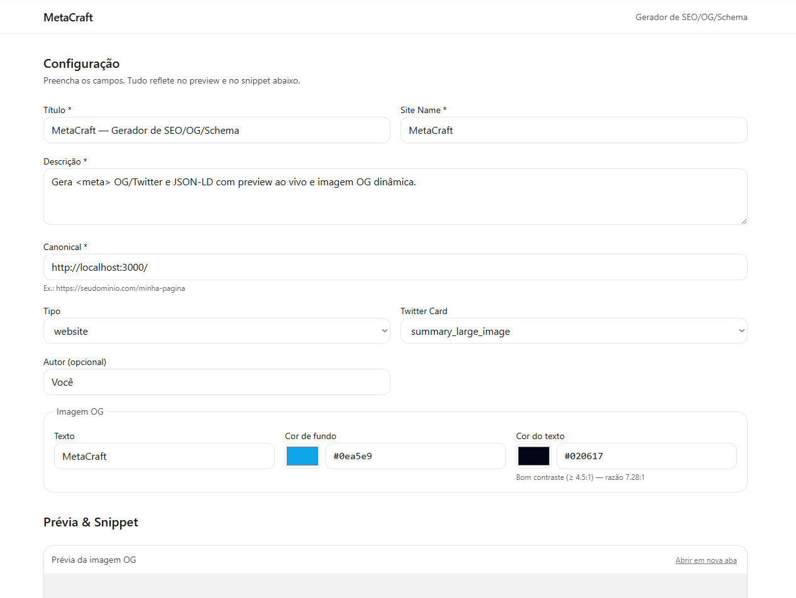

# MetaCraft — Gerador de SEO/OG/Schema

Gera metatags **Open Graph/Twitter** e **JSON‑LD** com **prévia ao vivo**, cria **imagem OG dinâmica** via `/api/og` (sem Photoshop), valida campos com **RHF + Zod**, checa **contraste (WCAG)** e permite **compartilhar o estado via URL**.

> Stack: **Next.js 15**, **TypeScript**, **Tailwind CSS v4**, **React Hook Form**, **Zod**, **@vercel/og**, **Vercel**.

<p align="center">
  
</p>

---

## Índice
- [Demo](#demo)
- [Funcionalidades](#funcionalidades)
- [Como usar](#como-usar)
- [Instalação](#instalação)
- [Scripts](#scripts)
- [Configuração](#configuração)
- [Estrutura do projeto](#estrutura-do-projeto)
- [Como funciona (por dentro)](#como-funciona-por-dentro)
- [Acessibilidade](#acessibilidade)
- [API /api/og](#api-apiog)
- [Roadmap](#roadmap)
- [Contribuindo](#contribuindo)
- [Licença](#licença)

---

## Demo

- **Preview (Vercel):** `https://metacraft-54r2.vercel.app`

Links úteis para testar rapidamente:
- Home com parâmetros:  
  `/ ?title=Hello&description=Descrição%20de%20teste&siteName=MetaCraft&canonical=https://exemplo.com/`
- Imagem OG direta:  
  `/api/og?title=MetaCraft&bg=%230ea5e9&fg=%23020617`

> Dica: mande a URL com parâmetros para alguém e a pessoa abrirá a página **já preenchida**.

---

## Funcionalidades

- **Cartões de compartilhamento (OG/Twitter)**: gera `<meta>` corretas para WhatsApp/LinkedIn/X.
- **Imagem OG dinâmica**: `/api/og` monta PNG **1200×630** com título/cores — sem editor de imagem.
- **JSON‑LD (Schema.org)**: injeta `<script type="application/ld+json">` com `WebSite/Article/Person`.
- **Prévia ao vivo do `<head>`**: veja o snippet pronto e **copie com 1 clique**.
- **Estado via URL**: tudo que você digita vira `?title=...` etc.; ótimo pra colaboração.
- **Validação**: **React Hook Form + Zod** (erros claros: URL inválida, campos obrigatórios).
- **A11y**: skip link, foco visível, labels/erros vinculados, live region, aviso de carregamento, **checagem de contraste WCAG**.
- **UI limpa**: layout responsivo, cards, tipografia clara.

---

## Como usar

1. Preencha **Título**, **Descrição**, **Site Name** e **Canonical**.
2. Escolha **Tipo** (website/article) e **Twitter Card** (summary ou summary_large_image).
3. Ajuste **Imagem OG**: texto + cores (BG/FG). O preview muda na hora.
4. Copie o **snippet do `<head>`** e cole no seu projeto (ou use o `generateMetadata` já pronto aqui).
5. Compartilhe o link da página (os valores seguem na URL).

> O Google entende melhor sua página com o **JSON‑LD**; as redes sociais mostram um card bonito graças às **metatags OG/Twitter**; e a **imagem OG** personalizada dá _boost_ de cliques.

---

## Instalação

Requisitos:
- **Node 22.x** (recomendado)
- **npm** ou **pnpm**

Clone e instale:
```bash
npm i
npm run dev
# http://localhost:3000
```

Deploy na Vercel:
1. Conecte o repositório
2. (Opcional) Project Settings → **Node 22.x**
3. (Opcional) Variáveis → `NEXT_PUBLIC_BASE_URL=https://seu-dominio.com`

---

## Scripts
```bash
npm run dev     # modo desenvolvimento
npm run build   # build de produção
npm run start   # servir produção local
```

---

## Configuração

**Variáveis de ambiente**
```bash
# Em produção, usado para montar a URL absoluta das OG images
NEXT_PUBLIC_BASE_URL=https://seu-dominio.com
```

**Tailwind v4**
- `postcss.config.mjs` com `@tailwindcss/postcss`
- `app/globals.css` com `@import "tailwindcss";`

---

## Estrutura do projeto

```
src/
  app/
    api/
      og/
        route.tsx      # @vercel/og (ImageResponse) – imagem OG dinâmica
    components/
      Generator.tsx    # formulário + preview + snippet + a11y + contraste
    globals.css
    layout.tsx         # layout base + skip link
    page.tsx           # generateMetadata + JSON-LD por searchParams
postcss.config.mjs
```

---

## Como funciona (por dentro)

- **`page.tsx`**
  - Usa `generateMetadata` para montar `<title>`, metas OG/Twitter e canonicals **a partir dos `searchParams`**.
  - Injeta **JSON‑LD** com `WebSite/Article/Person`.
- **`Generator.tsx`**
  - Form **React Hook Form + Zod** com validação e erros acessíveis.
  - Atualiza a URL (query string) a cada mudança com um pequeno debounce.
  - Gera o **snippet** pronto para copiar.
  - Calcula contraste **WCAG** (mensagem: bom / ok p/ texto grande / baixo).
- **`/api/og`**
  - Handler com **`@vercel/og`** criando PNG 1200×630. Params: `title`, `bg` (hex), `fg` (hex).

---

## Acessibilidade

- **Skip link**: “Pular para o conteúdo”.
- **Labels + `aria-errormessage`**: leitores de tela anunciam os erros.
- **Live region**: anuncia atualização do preview e status de cópia.
- **Foco visível**: `focus-visible` com highlights.
- **Contraste**: mensagem com a razão estimada (WCAG).

> Dica: use cores com contraste ≥ **4.5:1** para textos normais.

---

## API `/api/og`

**GET** `/api/og?title=Texto&bg=%230ea5e9&fg=%23020617`

Parâmetros:
- `title` *(string)* — texto grande no centro.
- `bg` *(string)* — cor de fundo em hex (`#RRGGBB` ou `#RGB`).
- `fg` *(string)* — cor do texto em hex.

Resposta: **image/png** (1200×630)

Exemplos:
```bash
# Curl simples
curl "https://seu-dominio.com/api/og?title=MetaCraft&bg=%230ea5e9&fg=%23020617" --output og.png
```


## Roadmap

- **Presets** (localStorage): Post de Blog / Página de Serviço / Produto.
- **JSON‑LD avançado**: campos específicos por tipo (Article: `datePublished`, `author` etc.).
- **Export**: “Copiar `<head>`” e “Baixar PNG da OG”.
- **i18n** (pt/en) e layout de impressão.
- **Testes**: unit (utils) e e2e (acessibilidade básica).

---

## Contribuindo

1. Faça um fork
2. Crie uma branch: `git checkout -b feat/minha-feature`
3. Commit: `git commit -m "feat: adiciona X`
4. Push e abra um PR

Padrão de commits sugerido: **Conventional Commits**.

---

## Licença

MIT

